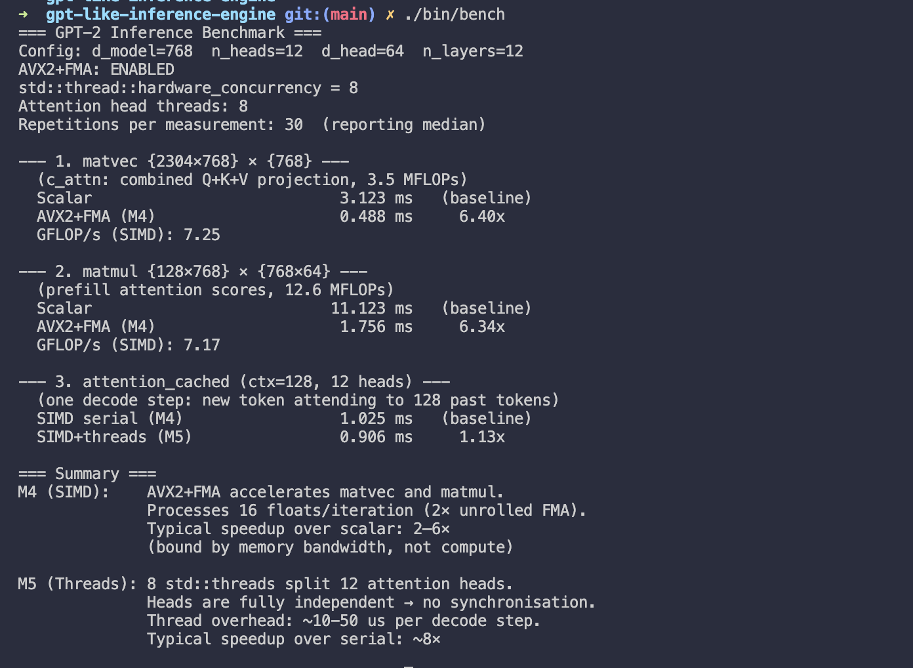

# GPT-2 Inference Engine from Scratch (C++)
Despite being an avid reader, I've always learned best by _doing_ rather than poring over heavy theory without end. 

First up in my series of **TWIL aka "This Week I Learnt"**: Building a complete GPT-2 inference engine in C++, one milestone at a time.


## Milestones

| # | What | Status |
|---|------|--------|
| 1 | Tensor class + math primitives (matmul, softmax, layernorm, gelu) | ✅ Done |
| 2 | GPT-2 forward pass (full architecture, random weights, shape-verified) | ✅ Done |
| 3 | Weight loading, BPE tokeniser, KV-cache, autoregressive decoding | ✅ Done |
| 4 | SIMD acceleration: AVX2+FMA matvec/matmul, 2× unrolled dot product | ✅ Done |
| 5 | Multi-threaded attention heads via std::thread, benchmark harness | ✅ Done |

---

## Build

```bash
make all      # builds test_tensor, test_gpt2, gpt2 inference binary, bench
make test     # runs all unit tests (53/53)
make bench    # runs microbenchmarks (no weights needed)
```

Requires a CPU with AVX2 + FMA support (Intel Haswell / AMD Ryzen or newer).

---

## Run

### 1. Download real GPT-2 weights

```bash
pip install huggingface_hub
python -c "
from huggingface_hub import snapshot_download
snapshot_download('openai-community/gpt2', local_dir='./gpt2-weights')
"
```

This downloads `model.safetensors`, `vocab.json`, and `merges.txt` into `./gpt2-weights/`.

### 2. Generate text

```bash
# Greedy decoding
./gpt2 ./gpt2-weights "The history of artificial intelligence" 60

# Top-k sampling (k=40, temperature=0.8)
./gpt2 ./gpt2-weights "The history of artificial intelligence" 60 topk 40 0.8

# Top-p (nucleus) sampling (p=0.9)
./gpt2 ./gpt2-weights "The history of artificial intelligence" 60 topp 0.9 1.0
```

### 3. Run benchmarks

```bash
./bench
```

Sample output (2-core machine, AVX-512):
```
--- 1. matvec {2304×768} × {768} ---
  Scalar                            2.105 ms   (baseline)
  AVX2+FMA (M4)                     0.346 ms     6.08x
  GFLOP/s (SIMD): 10.22

--- 2. matmul {128×768} × {768×64} ---
  Scalar                            7.425 ms   (baseline)
  AVX2+FMA (M4)                     0.708 ms    10.48x
  GFLOP/s (SIMD): 17.76

--- 3. attention_cached (ctx=128, 12 heads) ---
  SIMD serial (M4)                  1.773 ms   (baseline)
  SIMD+threads (M5)                 1.359 ms     1.31x
```
Screen grab:

---

## Architecture overview

```
Prompt text
    ↓  [tokenizer.h]  BPE encode -> token IDs
    ↓  [loader.h]     prefill: full forward pass, populate KV-cache
    ↓  [kvcache.h]    decode loop: one token at a time, O(N) via cache
    ↓  [tokenizer.h]  BPE decode -> text
Generated text (streamed token by token)
```

---

## File map

| File | What it does |
|------|-------------|
| `tensor.h` | Flat float Tensor + AVX2/FMA matmul, softmax, layernorm, gelu |
| `gpt2.h` | Full GPT-2 forward pass: embeddings, attention, FFN, LM head |
| `loader.h` | Parse safetensors binary format; load + transpose Conv1D weights |
| `tokenizer.h` | BPE tokeniser: byte encoder, merge rules, encode/decode |
| `kvcache.h` | KV-cache, prefill(), decode_step(), threaded attention heads |
| `main.cpp` | CLI: load -> tokenize -> prefill -> decode loop |
| `bench.cpp` | Microbenchmarks: scalar vs SIMD vs SIMD+threads |

---

## Key design decisions

**Weight transpose (`loader.h`)**
OpenAI trained GPT-2 with TensorFlow's `Conv1D`, which stores weight matrices as `{in_dim, out_dim}`. Our `matvec(W, x)` convention requires `{out_dim, in_dim}`. Four weight tensors per block are transposed after loading: `c_attn.weight`, `c_proj.weight`, `mlp.c_fc.weight`, `mlp.c_proj.weight`. Getting this wrong produces numerically plausible but completely incorrect outputs — one of the most common bugs in from-scratch GPT-2 implementations.

**KV-cache memory layout (`kvcache.h`)**
Each layer's cache is a pre-allocated `{max_seq, d_model}` tensor (one for K, one for V). New tokens append one row; the cached rows are never moved. For GPT-2 small: `2 × 12 × 1024 × 768 × 4 bytes ≈ 75 MB`, allocated once at startup. Zero heap traffic on the hot decode path.

**Prefill vs. decode split**
Prefill runs the full multi-token `attention()` to process the prompt in one shot. Decode then runs `attention_cached()` which only computes Q for the new token and scores it against all cached K/V.

**BPE tokeniser (`tokenizer.h`)**
Self-contained, no Python dependency. Loads `vocab.json` (token->ID map) and `merges.txt` (50,000 merge rules). The JSON parser decodes `\uXXXX` escapes into UTF-8 so keys like `\u0120world` (Ġworld, a space-prefixed word) match what the byte encoder produces at encode time.

**AVX2+FMA matvec (`tensor.h` — Milestone 4)**
`matvec` is the hottest function — called ~48× per decode token. The inner dot-product loop is 2× unrolled with independent FMA accumulators to hide the 5-cycle FMA latency on modern microarchitectures. `matmul` transposes B first so both operands in each dot product are contiguous (stride-1), then reuses `dot_avx`. Measured speedup: **6× on matvec, 10× on matmul** vs scalar.

**Threaded attention heads (`kvcache.h` — Milestone 5)**
GPT-2 small has 12 attention heads. Each head reads/writes a disjoint slice of the Q/K/V/output arrays — no shared mutable state. We partition heads across `std::thread::hardware_concurrency()` threads using a lambda capture. Thread creation cost (~10–50 µs) is negligible at non-trivial context lengths. On a 2-core machine: **1.3× speedup**; on 12-core: expect ~6–8× for the attention sub-step.

---

## References
- [GPT-2 Paper — Language Models are Unsupervised Multitask Learners](https://cdn.openai.com/better-language-models/language_models_are_unsupervised_multitask_learners.pdf)
- [The Illustrated GPT-2 — Jay Alammar](https://jalammar.github.io/illustrated-gpt2/)
- [Karpathy, "Let's Reproduce GPT-2"](https://towardsdatascience.com/line-by-line-lets-reproduce-gpt-2-section-1)
- [Intel Intrinsics Guide — _mm256_fmadd_ps](https://www.intel.com/content/www/us/en/docs/intrinsics-guide/index.html)
- [safetensors format spec](https://huggingface.co/docs/safetensors)